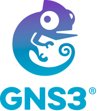
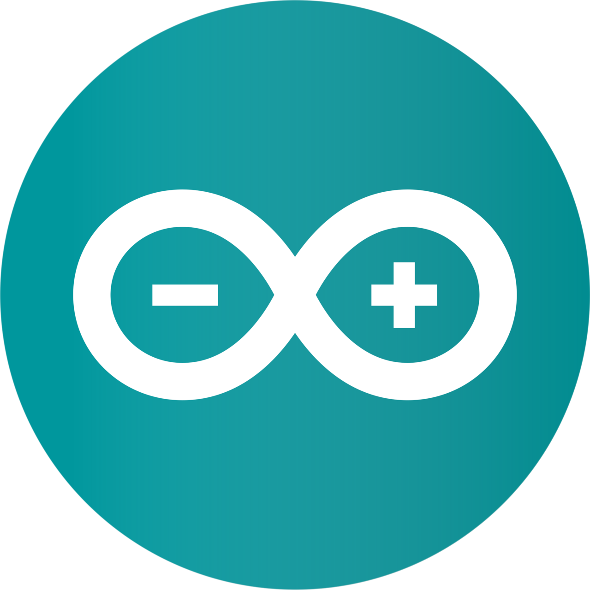
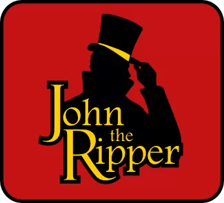
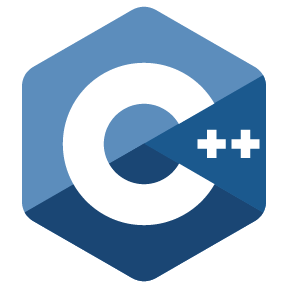
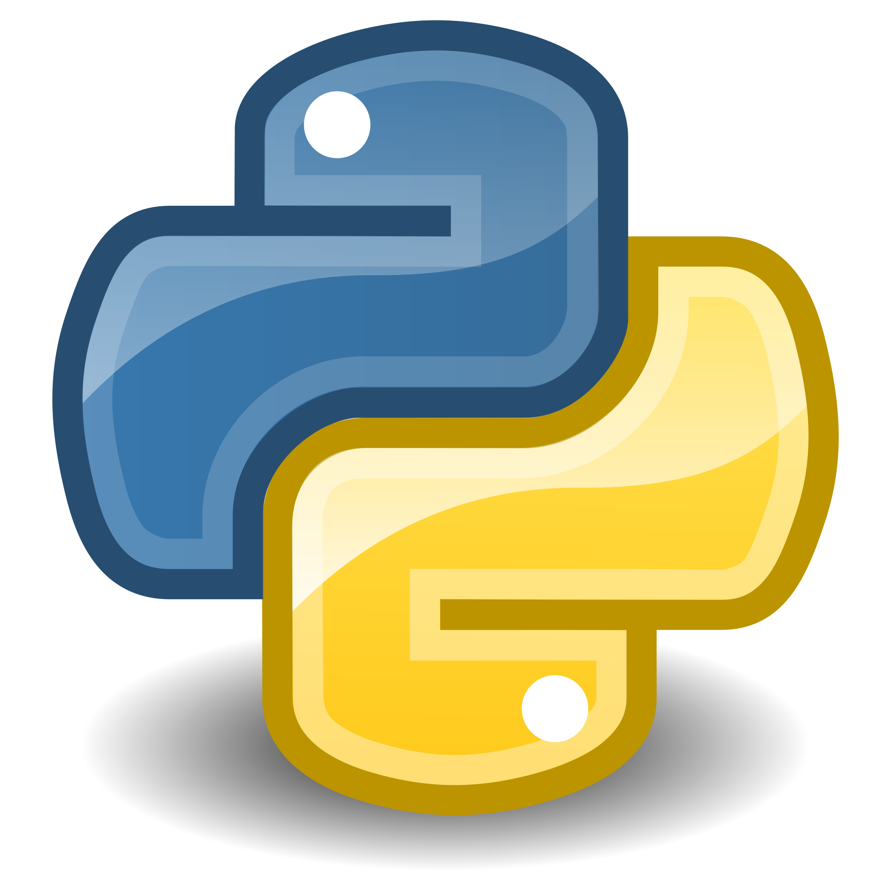

### Hi there, I´m Anabel Díaz Labrador👋

  
  
  
    
  - 🏛️ I'm computer scientist with an mention in computer engineering 
    - I have knowledge in complex algorithms, data structures, computer architecture, CPU design, GPU programming, FPGA programming, concurrent programming, embedded systems, advanced operating systems, databases, software engineering, network security, network administration, distributed systems, ROS, due to my career.
  - 🤖 I have a master's degree in robotics, where I have learned more about ROS, and I have learned about autonomous systems, virtual instrument programming, IoT, Industrial automation, mobile robotics (UGVs, UAVs and especially UUVs robots), computer vision, machine learning.
  - 📚 I'm currently studying an Industrial PhD in Robotics focused on developing autonomous robotic systems that integrate computer vision, NLP, and navigation. My research centers on enabling robots to collect, analyze, and share environmental data, with applications in security, surveillance, and emergency response.
  - 🌱 I'm interesed 
    

## 🔨 Tools

  <code></code>
  <code></code>
  <code></code>
  <code></code>                                                                                                  
  <code></code>
  <code></code>
  <code></code>
  <code></code>
  <code></code>
  <code></code>
  <code></code>
  <code></code>
  <code></code>
  <code></code>
  <code></code>
  <code></code>
  <code></code>
  <code></code>

## 👨‍💻 Languages 

  <code></code>
  <code></code>
  <code></code>
  <code></code>
  <code></code>
  <code></code>
  <code></code>
  <code></code>
  <code></code>
  <code></code>
  <code></code>
  <code></code>
  <code></code>
  <code></code

## 🌎 Social Media

  
  

